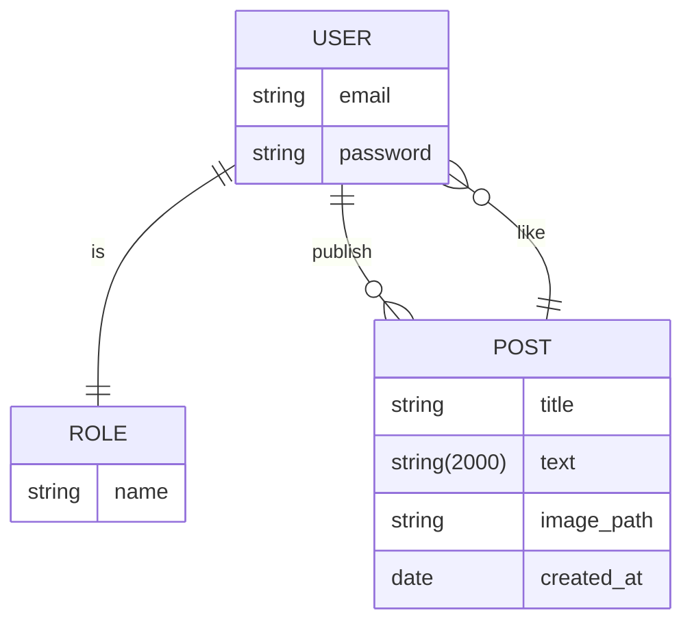

# Social Working Club

To run the Social Working Club web application, you first need to have the source on the machine by either `git clone` or whatever

## Install

Then complete the following instructions to install and run both the `backend` and the `frontend`.

**--> Backend:**

* Go to the `backend` directory: `cd backend`
* Install the project: `npm install`
* Run the server:
  * for development: `npm run dev`
  * for production: `npm run start`

**--> Frontend:**

* Got to the `frontend` directory: `cd frontend`
* Install the project: `npm install`
* Run the server:
  * for development: `npm run dev`
  * for production: `npm run build && npm run preview`

## Stack

**--> Backend:**

* Express
* MongoDB via Mongoose

**--> Frontend:**

* React via ViteJS

## Database

